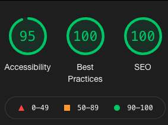

# CODE REFACTOR

### Upon loading the website and code, I noticed a few errors to be corrected as well as possible improvements to the SEO and accesibility. Please find screenshots below of the changes I made as well as descriptions for each. 

#### 1. Accesibility, Best Practices and SEO scores on lighthouse were greaty improved.
### 

#### 2. When clicking SEARCH ENGINE OPTIMIZATION in header, site did not scroll to SEO content section. This issue has been fixed.
### 
### 
 

#### 3. CSS Style sheet has been cleaned up, eliminating repetitive code and streamlining the sheet while maintainint website functionality. 

#### Live URL: https://mloercher.github.io/seo/
#### Github URL: https://github.com/mloercher/seo